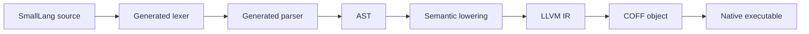

# SmallLang

SmallLang is a tiny native language experiment focused on simple syntax, fast
compiler structure, and LLVM-backed executable generation.

The current implementation is intentionally small: it accepts the first approved
language slice, lowers it to LLVM IR, and links a minimal Windows x64 executable.

```smalllang
getName: -> Text {
    "dimohy"
}

square: Int -> Int {
    it * it
}

main {
    getName -> name
    7 -> square -> num
    "Hello, {name}. square = {num}" -> print
}
```

The verified output is:

```text
Hello, dimohy. square = 49
```

The `value -> function` form is the preferred SmallLang call style for making data
flow explicit. Parenthesized calls such as `print(...)` remain valid as a
compatibility form.

The current generated executable is **1,088 bytes**.

## Status

SmallLang is in an early compiler-building phase. The implementation is scoped to
the accepted language specification and decision log.

What works today:

- `main { ... }`
- zero-argument functions with `getName: -> Text { ... }`
- one-input functions with `square: Int -> Int { ... }`
- local string bindings with `name = "value"`
- value-flow bindings with `getName -> name` and `7 -> square -> num`
- left-associative integer `+` and `*`
- string interpolation with `"Hello, {name}"`
- interpolation of string and integer bindings
- value-flow calls with `value -> function`
- parenthesized calls with `function(value)`
- source-generated lexing from `syntax/smalllang.lexer`
- source-generated parsing from `syntax/smalllang.grammar`
- LLVM IR generation
- Windows x64 executable linking through `clang` and `lld-link`

## Build

```powershell
.\scripts\smalllang.ps1 -Source examples\hello.smalllang -Output artifacts\hello.exe -KeepTemps
```

On first use, the script downloads LLVM 22.1.8 into `.tools`. LLVM binaries,
build outputs, and generated executables are intentionally ignored by Git.

The compiler itself targets .NET 11 Preview and uses C# Preview.

## Pipeline



## Lexer Rules

Lexer rules are written in a compact DSL:

```text
token Identifier = identifier
token String = quoted_string
token Number = number
token LeftBrace = "{"
token RightBrace = "}"
token LeftParen = "("
token RightParen = ")"
token Dot = "."
token Comma = ","
token Plus = "+"
token Star = "*"
token Arrow = "->"
token Colon = ":"
token Equal = "="
token NewLine = newline
token End = end
```

`src/SmallLang.Compiler.Generators` reads `syntax/smalllang.lexer` as an MSBuild
`AdditionalFiles` input and generates `TokenKind` and `Lexer` during the C#
build.

## Grammar Rules

Parser rules are also written in a compact DSL:

```text
rule SourceFile = NewLine* FunctionDeclaration* MainBlock NewLine* End
rule FunctionDeclaration = Identifier Colon FunctionSignature LeftBrace NewLine* Expression NewLine* RightBrace
rule FunctionSignature = Arrow TypeName | TypeName Arrow TypeName
rule MainBlock = Identifier("main") LeftBrace NewLine* Statement* RightBrace
rule BindingStatement = Identifier Equal Expression StatementEnd
rule Expression = FlowExpression
rule FlowExpression = AdditiveExpression (Arrow Path)*
rule AdditiveExpression = MultiplicativeExpression (Plus MultiplicativeExpression)*
rule MultiplicativeExpression = PrimaryExpression (Star PrimaryExpression)*
rule PrimaryExpression = CallExpression | StringExpression | NumberExpression | NameExpression
rule TypeName = Identifier
```

The generator reads `syntax/smalllang.grammar` and emits the current recursive
descent parser at compile time. The grammar generator is intentionally narrow
for the first language slice; it validates the declared rules and produces the
parser shape needed by the approved syntax.

## Repository Layout

- `examples/hello.smalllang`: the current SmallLang sample
- `scripts/smalllang.ps1`: local build/bootstrap script
- `syntax/smalllang.lexer`: concise lexer rule source
- `syntax/smalllang.grammar`: concise parser rule source
- `src/SmallLang.Compiler.Generators`: Roslyn incremental source generator
- `src/SmallLang.Compiler/Cli`: command line orchestration
- `src/SmallLang.Compiler/Lexing`: token model; Lexer and TokenKind are generated
- `src/SmallLang.Compiler/Parsing`: parser helpers; Parser is generated
- `src/SmallLang.Compiler/Syntax`: AST nodes
- `src/SmallLang.Compiler/Semantics`: current semantic lowering
- `src/SmallLang.Compiler/CodeGen`: LLVM IR generation
- `src/SmallLang.Compiler/Tooling`: LLVM/lld tool integration
- `docs/SPEC.md`: living language specification
- `docs/DECISIONS.md`: decision log

## Notes

This repository does not commit LLVM binaries or generated executables. The
first compiler backend is Windows x64 only; cross-platform backends are part of
the language direction but are not implemented yet.

## License

SmallLang is licensed under the [Apache License 2.0](LICENSE).
