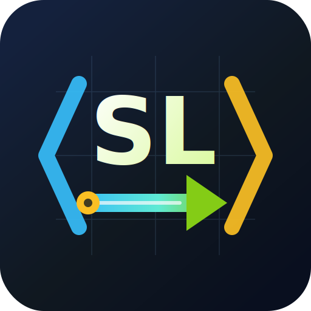

<p align="center">
  
</p>

# SmallLang

SmallLang is a tiny native language experiment focused on simple syntax, fast
compiler structure, and LLVM-backed executable generation.

It currently accepts a compact `.sl` language slice, lowers it to LLVM IR, and
links minimal Windows x64 or Linux x64 executables. The language favors explicit
value flow with `value -> target` syntax and expression-first bindings with
`value => name`.

## Quick Look

- `.sl` source files
- value-flow calls and bindings, such as `"text" -> print` and
  `7 -> square => num`
- `main { ... }` or omitted `main` with top-level executable statements
- block-function calls such as `1..9 -> each i { ... }`
- flow-oriented `if` and `when` conditionals
- fixed and growable `Int` arrays, such as `[1, 2, 3]`, `[1, 2, ~]`,
  `[Int; ~]`, and `[Int; 1024~]`
- compile-time `Int` value generics and size-checked `[Int; N]` parameters
- `{Int: Int}` dictionaries, such as `{ 1: 100, 2: 200 }`, `{Int: Int}`,
  and `{Int: Int; 1024~}`
- readonly `[Int]` function parameters for non-owning array views
- readonly `{Int: Int}` function parameters for non-owning dictionary views
- `mut [Int; ~]` and `mut {Int: Int}` function parameters for non-owning
  mutable container borrows
- explicit `move` growable array and dictionary parameters, including returning
  the consumed input owner to the caller
- automatic stack promotion for small, non-escaping, readonly dynamic-array
  and dictionary literals
- lifetime-based function-entry stack slots reused across nested branches and
  loop iterations
- small fixed arrays and mutable container metadata placed in entry slots, with
  oversized fixed arrays automatically moved to owned heap storage
- mutable owner names with `!` and checked indexed assignment
- move-consuming container transforms, such as `values -> append(3) => values`
- a SmallLang standard library under `stdlib/sys`
- source-generated lexer/parser code from compact grammar files
- LLVM-backed Windows x64, Linux x64, and browser WebAssembly output

## Example

```smalllang
getName: -> Text {
    "dimohy"
}

square: Int -> Int {
    it * it
}

main {
    getName() => name
    7 -> square => num
    "Hello, $name. square = $num" -> print
}
```

Verified output:

```text
Hello, dimohy. square = 49
```

Top-level executable statements can omit the `main` wrapper:

```smalllang
getName() => name
7 -> square => num
"Hello, $name. square = $num" -> sys.io.print
```

A range can flow into a block function:

```smalllang
"n = ? " -> readInt => n

1..9 -> each i {
    n * i => value
    "$n x $i = $value" -> println
}
```

Subject-style conditionals keep the tested value on the left:

```smalllang
95 => score

score -> when {
    90..100 => "A"
    80..89 => "B"
    else => "Needs practice"
} => grade
```

## Run A Sample

```powershell
.\scripts\smalllang.ps1 -Source examples\01-function-basic-hello.sl -Output artifacts\01-function-basic-hello.exe -KeepTemps
.\artifacts\01-function-basic-hello.exe
```

On first use, the script downloads LLVM 22.1.8 into `.tools`. LLVM binaries,
build outputs, and generated executables are intentionally ignored by Git.

Build the browser WebAssembly sample and serve the repository root with any
static file server:

```powershell
.\scripts\smalllang.ps1 -Source examples\23-webassembly-browser.sl -Output artifacts\23-webassembly-browser.wasm -Target wasm32-browser -KeepTemps
python -m http.server 5080
```

Then open `http://localhost:5080/examples/browser/`.

## Documentation

- [Getting started and implementation guide](docs/GETTING_STARTED.md)
- [Language specification](docs/SPEC.md)
- [Decision log](docs/DECISIONS.md)
- [Self-hosting roadmap and measured progress](docs/SELF_HOSTING_ROADMAP.md)
- [Array, dictionary, and ownership design](docs/ARRAYS.md)
- [VS Code language support extension](tools/vscode-smalllang/README.md)
- [Example programs](examples)

## Repository Map

- `examples`: cumulative `.sl` programs that track the grammar progression
- `examples/browser`: static browser runner for the WebAssembly sample
- `stdlib/sys`: standard library modules written in SmallLang
- `syntax`: lexer and grammar rule sources
- `src/SmallLang.Compiler`: compiler CLI, semantic lowering, and LLVM codegen
- `src/SmallLang.Compiler.Generators`: source generators for lexing/parsing
- `tests/SmallLang.ExampleTests`: expected stdout test runner
- `tools/vscode-smalllang`: local VS Code language support extension

Multiple user files can be compiled as one program. Library files contribute
namespaced declarations, and exactly one root file may contain executable
top-level statements:

```powershell
dotnet run --project src/SmallLang.Compiler -- build `
  examples/modules/52-math.sl examples/52-multi-file-modules.sl `
  -o artifacts/52-multi-file-modules.exe
```

## License

SmallLang is licensed under the [Apache License 2.0](LICENSE).
