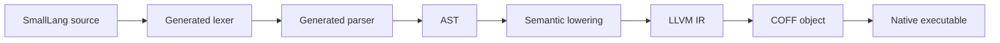

# SmallLang

SmallLang is a tiny native language experiment focused on simple syntax, fast
compiler structure, and LLVM-backed executable generation.

The current implementation is intentionally small: it accepts the first approved
language slice, lowers it to LLVM IR, and links a minimal Windows x64 executable.

```smalllang
getName: -> Text {
    "dimohy"
}

square: Int -> Int {
    it * it
}

main {
    getName -> name
    7 -> square -> num
    "Hello, {name}. square = {num}" -> print
}
```

The `main` wrapper can also be omitted for top-level executable statements:

```smalllang
getName -> name
7 -> square -> num
"Hello, {name}. square = {num}" -> sys.io.print
```

The verified output is:

```text
Hello, dimohy. square = 49
```

The `value -> function` form is the preferred SmallLang call style for making data
flow explicit. Parenthesized calls such as `print(...)` remain valid as a
compatibility form.

The current `hello.sl`, `hello-named-arg.sl`, and `hello-top-level.sl`
executables are **1,104 bytes**. The cumulative input and loop sample
executables are **1,584 bytes**.

## Status

SmallLang is in an early compiler-building phase. The implementation is scoped to
the accepted language specification and decision log.

What works today:

- `main { ... }` or omitted `main` with top-level executable statements
- zero-argument functions with `getName: -> Text { ... }`
- one-input functions with default `it` or an explicit input name:
  `square: Int -> Int { ... }` and `square n: Int -> Int { ... }`
- value-flow bindings with `"value" -> name`, `getName -> name`, and `7 -> square -> num`
- left-associative integer `+` and `*`
- string interpolation with `"Hello, {name}"`
- interpolation of string and integer bindings
- value-flow calls with `value -> function`
- parenthesized calls with `function(value)`
- SmallLang standard library functions `sys.io.print`, `sys.io.println`, and
  `sys.io.readInt` with global `print`, `println`, and `readInt` aliases
- integer input with `"n = ? " -> readInt -> n` or `"n = ? " -> sys.io.readInt -> n`
- line output with `value -> println` or `value -> sys.io.println`
- block-function calls with `range -> each item { ... }`
- closed integer range loops with `1..9 -> each i { ... }`
- default loop item binding with `1..9 -> each { ... }`, exposed as `it`
- source-generated lexing from `syntax/smalllang.lexer`
- source-generated parsing from `syntax/smalllang.grammar`
- LLVM IR generation
- Windows x64 executable linking through `clang` and `lld-link`

## Build

```powershell
.\scripts\smalllang.ps1 -Source examples\hello.sl -Output artifacts\hello.exe -KeepTemps
```

The input and loop sample is cumulative; it does not replace `hello.sl`:

```powershell
.\scripts\smalllang.ps1 -Source examples\gugudan.sl -Output artifacts\gugudan.exe -KeepTemps
```

The explicit function input-name sample is also cumulative:

```powershell
.\scripts\smalllang.ps1 -Source examples\hello-named-arg.sl -Output artifacts\hello-named-arg.exe -KeepTemps
```

The top-level and canonical `sys.io` sample is cumulative:

```powershell
.\scripts\smalllang.ps1 -Source examples\hello-top-level.sl -Output artifacts\hello-top-level.exe -KeepTemps
```

The same multiplication table can use the default loop item name:

```powershell
.\scripts\smalllang.ps1 -Source examples\gugudan-it.sl -Output artifacts\gugudan-it.exe -KeepTemps
```

The same input and output primitives can be addressed through `sys.io`:

```powershell
.\scripts\smalllang.ps1 -Source examples\gugudan-sys-io.sl -Output artifacts\gugudan-sys-io.exe -KeepTemps
```

On first use, the script downloads LLVM 22.1.8 into `.tools`. LLVM binaries,
build outputs, and generated executables are intentionally ignored by Git.

The compiler itself targets .NET 11 Preview and uses C# Preview.

## Pipeline



## Lexer Rules

Lexer rules are written in a compact DSL:

```text
token Identifier = identifier
token String = quoted_string
token Number = number
token LeftBrace = "{"
token RightBrace = "}"
token LeftParen = "("
token RightParen = ")"
token Range = ".."
token Dot = "."
token Comma = ","
token Plus = "+"
token Star = "*"
token Arrow = "->"
token Colon = ":"
token Equal = "="
token NewLine = newline
token End = end
```

`src/SmallLang.Compiler.Generators` reads `syntax/smalllang.lexer` as an MSBuild
`AdditionalFiles` input and generates `TokenKind` and `Lexer` during the C#
build.

## Grammar Rules

Parser rules are also written in a compact DSL:

```text
rule SourceFile = NewLine* FunctionDeclaration* (MainBlock | Statement*) NewLine* End
rule FunctionDeclaration = Path Identifier? Colon FunctionSignature FunctionBody
rule FunctionSignature = Arrow TypeName | TypeName Arrow TypeName
rule FunctionBody = LeftBrace NewLine* Expression NewLine* RightBrace | Equal Identifier("intrinsic")
rule MainBlock = Identifier("main") LeftBrace NewLine* Statement* RightBrace
rule Statement = BlockFunctionCallStatement | EachStatement | BindingStatement | ExpressionStatement
rule BlockFunctionCallStatement = RangeExpression Arrow Path Identifier? LeftBrace NewLine* Statement* RightBrace
rule EachStatement = Identifier("each") Identifier Identifier("in") RangeExpression LeftBrace NewLine* Statement* RightBrace
rule BindingStatement = Identifier Equal Expression StatementEnd
rule RangeExpression = Expression Range Expression
rule Expression = FlowExpression
rule FlowExpression = AdditiveExpression (Arrow Path)*
rule AdditiveExpression = MultiplicativeExpression (Plus MultiplicativeExpression)*
rule MultiplicativeExpression = PrimaryExpression (Star PrimaryExpression)*
rule PrimaryExpression = CallExpression | StringExpression | NumberExpression | NameExpression
rule TypeName = Identifier
```

The generator reads `syntax/smalllang.grammar` and emits the current recursive
descent parser at compile time. A final single identifier in a value-flow
statement binds the flowing value, so `n * i -> value` is the preferred binding
style for new samples. Range loops prefer `1..9 -> each i { ... }`; when the item
name is omitted as `1..9 -> each { ... }`, the loop item is available as `it`.
One-input functions follow the same naming shape: `square: Int -> Int` exposes
the input as `it`, while `square n: Int -> Int` exposes it as `n`.
`each` is modeled as the first built-in block function: `1..9 -> each i { ... }`
means the range flows into `each` and the block is passed as its executable body.
The current backend lowers this built-in directly to LLVM basic blocks rather
than emitting a runtime closure, function pointer, or block-call dispatch.
The `sys.io` module is implemented in SmallLang under `stdlib/sys/io.sl`.
`stdlib/sys/runtime.sl` declares the lower `sys.runtime.*` intrinsic boundary.
The compiler loads these standard library files before user code and globally
aliases `print`, `println`, and `readInt` to `sys.io.print`, `sys.io.println`,
and `sys.io.readInt`.
The grammar generator is intentionally narrow for the first language slice; it
validates the declared rules and produces the parser shape needed by the
approved syntax.

## Repository Layout

- `examples/hello.sl`: first runtime function and value-flow sample
- `examples/hello-named-arg.sl`: cumulative explicit function input-name sample
- `examples/hello-top-level.sl`: cumulative omitted-main and `sys.io.print` sample
- `examples/gugudan.sl`: cumulative input plus range loop sample
- `examples/gugudan-it.sl`: cumulative range loop sample with default `it`
- `examples/gugudan-sys-io.sl`: cumulative `sys.io.readInt` and `sys.io.println` sample
- `stdlib/sys/runtime.sl`: standard library intrinsic boundary declarations
- `stdlib/sys/io.sl`: SmallLang implementation of `sys.io` wrappers
- `scripts/smalllang.ps1`: local build/bootstrap script
- `syntax/smalllang.lexer`: concise lexer rule source
- `syntax/smalllang.grammar`: concise parser rule source
- `src/SmallLang.Compiler.Generators`: Roslyn incremental source generator
- `src/SmallLang.Compiler/Cli`: command line orchestration
- `src/SmallLang.Compiler/Lexing`: token model; Lexer and TokenKind are generated
- `src/SmallLang.Compiler/Parsing`: parser helpers; Parser is generated
- `src/SmallLang.Compiler/Syntax`: AST nodes
- `src/SmallLang.Compiler/Semantics`: current semantic lowering
- `src/SmallLang.Compiler/CodeGen`: LLVM IR generation
- `src/SmallLang.Compiler/Tooling`: LLVM/lld tool integration
- `docs/SPEC.md`: living language specification
- `docs/DECISIONS.md`: decision log

## Notes

This repository does not commit LLVM binaries or generated executables. The
first compiler backend is Windows x64 only; cross-platform backends are part of
the language direction but are not implemented yet.

## License

SmallLang is licensed under the [Apache License 2.0](LICENSE).
