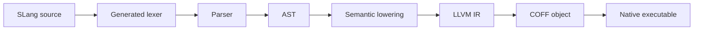

# SLang

SLang is a tiny native language experiment focused on simple syntax, fast
compiler structure, and LLVM-backed executable generation.

The current implementation is intentionally small: it accepts the first approved
language slice, lowers it to LLVM IR, and links a minimal Windows x64 executable.

```slang
main {
    name = "dimohy"
    print("Hello, {name}")
}
```

The verified output is:

```text
Hello, dimohy
```

The current generated executable is **752 bytes**.

## Status

SLang is in an early compiler-building phase. The implementation is scoped to
the accepted language specification and decision log.

What works today:

- `main { ... }`
- local string bindings with `name = "value"`
- string interpolation with `"Hello, {name}"`
- `print(...)`
- source-generated lexing from `syntax/slang.lexer`
- LLVM IR generation
- Windows x64 executable linking through `clang` and `lld-link`

## Build

```powershell
.\scripts\slang.ps1 -Source examples\hello.slang -Output artifacts\hello.exe -KeepTemps
```

On first use, the script downloads LLVM 22.1.8 into `.tools`. LLVM binaries,
build outputs, and generated executables are intentionally ignored by Git.

The compiler itself targets .NET 11 Preview and uses C# Preview.

## Pipeline



## Lexer Rules

Lexer rules are written in a compact DSL:

```text
token Identifier = identifier
token String = quoted_string
token LeftBrace = "{"
token RightBrace = "}"
token Equal = "="
token NewLine = newline
token End = end
```

`src/SLang.Compiler.Generators` reads `syntax/slang.lexer` as an MSBuild
`AdditionalFiles` input and generates `TokenKind` and `Lexer` during the C#
build.

## Repository Layout

- `examples/hello.slang`: the first SLang program
- `scripts/slang.ps1`: local build/bootstrap script
- `syntax/slang.lexer`: concise lexer rule source
- `src/SLang.Compiler.Generators`: Roslyn incremental source generator
- `src/SLang.Compiler/Cli`: command line orchestration
- `src/SLang.Compiler/Lexing`: token model; Lexer and TokenKind are generated
- `src/SLang.Compiler/Parsing`: parser
- `src/SLang.Compiler/Syntax`: AST nodes
- `src/SLang.Compiler/Semantics`: current semantic lowering
- `src/SLang.Compiler/CodeGen`: LLVM IR generation
- `src/SLang.Compiler/Tooling`: LLVM/lld tool integration
- `docs/SPEC.md`: living language specification
- `docs/DECISIONS.md`: decision log

## Notes

This repository does not commit LLVM binaries or generated executables. The
first compiler backend is Windows x64 only; cross-platform backends are part of
the language direction but are not implemented yet.

## License

SLang is licensed under the [Apache License 2.0](LICENSE).
