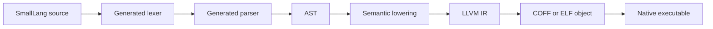

# SmallLang

SmallLang is a tiny native language experiment focused on simple syntax, fast
compiler structure, and LLVM-backed executable generation.

The current implementation is intentionally small: it accepts the first approved
language slice, lowers it to LLVM IR, and links minimal Windows x64 or Linux x64
executables.

```smalllang
getName: -> Text {
    "dimohy"
}

square: Int -> Int {
    it * it
}

main {
    getName() -> name
    7 -> square() -> num
    "Hello, {name}. square = {num}" -> print()
}
```

The `main` wrapper can also be omitted for top-level executable statements:

```smalllang
getName() -> name
7 -> square() -> num
"Hello, {name}. square = {num}" -> sys.io.print()
```

The verified output is:

```text
Hello, dimohy. square = 49
```

The `value -> function()` form is the preferred SmallLang call style for making
data flow explicit while keeping the target visibly function-like. Parenthesized
calls such as `print(...)` remain valid as a compatibility form. Empty
target-call syntax is valid only after `->`: `7 -> square()` and
`"text" -> print()`. The flowed value remains the argument; `-> square(7)` is not
valid. The exception is a function-like target that is immediately followed by a
brace code block argument, such as `1..9 -> each i { ... }`; in that form the
block itself marks the target as a call, so `each()` is not used.

With the current Windows linker settings, representative executable sizes are
**1,536 bytes** for `01-function-basic-hello.sl` and `05-function-local.sl`, **2,048 bytes** for
`08-block-each-default-it.sl`, and **2,560 bytes** for the sorted-int-file workflow samples.

## Status

SmallLang is in an early compiler-building phase. The implementation is scoped to
the accepted language specification and decision log.

What works today:

- `main { ... }` or omitted `main` with top-level executable statements
- zero-argument functions with `getName: -> Text { ... }`
- one-input functions with default `it` or an explicit input name:
  `square: Int -> Int { ... }` and `square n: Int -> Int { ... }`
- single-expression function bodies with `name: Input -> Output -> expression`
- local functions declared inside a function body, scoped to that containing
  function
- value-flow bindings with `"value" -> name`, `getName() -> name`, and
  `7 -> square() -> num`
- integer `+`, `-`, `*`, `/`, `%`, unary `-`, and parenthesized expressions
- line comments with `#`
- `Bool` values from `true`/`false`, integer comparisons, and `and`/`or`/`not`
- flow-oriented conditionals with `condition -> if { ... } else { ... }`
- multi-branch `when { condition { ... } else { ... } }` expressions
- subject-value `when` with `value -> when { >= limit { ... } else { ... } }`
- subject-value `when` range arms with `value -> when { start..end { ... } }`
- compact `when` arms with `condition -> value`, including implicit `it` subject
  inside one-input functions
- string interpolation with `"Hello, {name}"`
- interpolation of string and integer bindings
- value-flow calls with `value -> function`
- value-flow target-call syntax with `value -> function()`
- parenthesized calls with `function(value)`
- SmallLang standard library functions `sys.io.print`, `sys.io.println`, and
  `sys.io.readInt` with global `print`, `println`, and `readInt` aliases
- `namespace` declarations and `import ... as ...` aliases for standard library
  module code
- integer input with `"n = ? " -> readInt() -> n` or
  `"n = ? " -> sys.io.readInt() -> n`
- line output with `value -> println()` or `value -> sys.io.println()`
- block-function calls with `range -> each item { ... }` and
  `count -> repeat item { ... }`, where the brace block is the call argument and
  `each()`/`repeat()` are intentionally omitted
- closed integer range loops with `1..9 -> each i { ... }`
- default loop item binding with `1..9 -> each { ... }`, exposed as `it`
- integer folds with `range -> fold initial acc, item { nextAcc }`
- purpose-oriented pseudo-random integer generation with `seedRandom` and
  `randomBelow`
- binary sorted `Int` file writing and nearest-value lookup with `openIntWriter`,
  `writeInt`, `openIntReader`, and `closestInt`
- source-generated lexing from `syntax/smalllang.lexer`
- source-generated parsing from `syntax/smalllang.grammar`
- LLVM IR generation
- Windows x64 executable linking through `clang` and `lld-link`
- Linux x64 executable linking through Windows LLVM object generation and WSL
  `cc`

## Build

The examples are named so a normal filename sort follows the grammar progression.
Start with the basic function/value-flow sample:

```powershell
.\scripts\smalllang.ps1 -Source examples\01-function-basic-hello.sl -Output artifacts\01-function-basic-hello.exe -KeepTemps
.\scripts\smalllang.ps1 -Source examples\02-function-named-input.sl -Output artifacts\02-function-named-input.exe -KeepTemps
.\scripts\smalllang.ps1 -Source examples\03-flow-call-parens.sl -Output artifacts\03-flow-call-parens.exe -KeepTemps
```

Top-level statements, local functions, arithmetic, comments, and block functions
are cumulative:

```powershell
.\scripts\smalllang.ps1 -Source examples\04-main-omitted-top-level.sl -Output artifacts\04-main-omitted-top-level.exe -KeepTemps
.\scripts\smalllang.ps1 -Source examples\05-function-local.sl -Output artifacts\05-function-local.exe -KeepTemps
.\scripts\smalllang.ps1 -Source examples\06-expression-arithmetic-comments.sl -Output artifacts\06-expression-arithmetic-comments.exe -KeepTemps
.\scripts\smalllang.ps1 -Source examples\07-block-each-explicit-item.sl -Output artifacts\07-block-each-explicit-item.exe -KeepTemps
.\scripts\smalllang.ps1 -Source examples\08-block-each-default-it.sl -Output artifacts\08-block-each-default-it.exe -KeepTemps
.\scripts\smalllang.ps1 -Source examples\09-namespace-sys-io.sl -Output artifacts\09-namespace-sys-io.exe -KeepTemps
.\scripts\smalllang.ps1 -Source examples\10-block-argument-omits-parens.sl -Output artifacts\10-block-argument-omits-parens.exe -KeepTemps
.\scripts\smalllang.ps1 -Source examples\11-block-function-exec-block-repeat.sl -Output artifacts\11-block-function-exec-block-repeat.exe -KeepTemps
.\scripts\smalllang.ps1 -Source examples\12-block-function-user-defined-yield.sl -Output artifacts\12-block-function-user-defined-yield.exe -KeepTemps
.\scripts\smalllang.ps1 -Source examples\13-block-fold-sum.sl -Output artifacts\13-block-fold-sum.exe -KeepTemps
```

Conditionals are cumulative:

```powershell
.\scripts\smalllang.ps1 -Source examples\14-condition-if.sl -Output artifacts\14-condition-if.exe -KeepTemps
.\scripts\smalllang.ps1 -Source examples\15-condition-when.sl -Output artifacts\15-condition-when.exe -KeepTemps
.\scripts\smalllang.ps1 -Source examples\16-condition-when-subject.sl -Output artifacts\16-condition-when-subject.exe -KeepTemps
.\scripts\smalllang.ps1 -Source examples\17-condition-when-range.sl -Output artifacts\17-condition-when-range.exe -KeepTemps
.\scripts\smalllang.ps1 -Source examples\18-condition-when-compact.sl -Output artifacts\18-condition-when-compact.exe -KeepTemps
```

The sorted-number workflow is also written in SmallLang. For quick verification,
the demo pair uses the same algorithm at 1,000 records:

```powershell
.\scripts\smalllang.ps1 -Source examples\19-stdlib-random-file-demo-generate.sl -Output artifacts\19-stdlib-random-file-demo-generate.exe -KeepTemps
.\artifacts\19-stdlib-random-file-demo-generate.exe
.\scripts\smalllang.ps1 -Source examples\20-stdlib-file-demo-query.sl -Output artifacts\20-stdlib-file-demo-query.exe -KeepTemps
.\artifacts\20-stdlib-file-demo-query.exe
```

The full generator creates 100,000,000 sorted 64-bit integer records in
`artifacts/random-sorted-100m.i64` by choosing one pseudo-random value from each
10-wide bucket in `1..1,000,000,000`:

```powershell
.\scripts\smalllang.ps1 -Source examples\21-stdlib-random-file-100m-generate.sl -Output artifacts\21-stdlib-random-file-100m-generate.exe -KeepTemps
.\artifacts\21-stdlib-random-file-100m-generate.exe

.\scripts\smalllang.ps1 -Source examples\22-stdlib-file-100m-query.sl -Output artifacts\22-stdlib-file-100m-query.exe -KeepTemps
.\artifacts\22-stdlib-file-100m-query.exe
```

Linux x64 output is available through WSL:

```powershell
.\scripts\smalllang.ps1 -Source examples\01-function-basic-hello.sl -Output artifacts\01-function-basic-hello-linux -Target linux-x64 -KeepTemps
wsl --exec /mnt/p/MyWorks/SmallLang/artifacts/01-function-basic-hello-linux
```

On first use, the script downloads LLVM 22.1.8 into `.tools`. LLVM binaries,
build outputs, and generated executables are intentionally ignored by Git.

Example stdout tests compile and run the samples listed under
`examples/expected`:

```powershell
dotnet run --project tests\SmallLang.ExampleTests\SmallLang.ExampleTests.csproj --no-build
```

## VS Code

SmallLang includes a local VS Code syntax-highlighting extension:

```powershell
Push-Location tools\vscode-smalllang
npx --yes @vscode/vsce package --no-dependencies --allow-missing-repository
code --install-extension .\smalllang-syntax-0.1.0.vsix
Pop-Location
```

The extension registers `.sl`, highlights value-flow syntax, function
declarations, block-function calls, strings with interpolation, comments,
conditionals, types, and operators, and includes snippets for common forms.

The compiler itself targets .NET 11 Preview and uses C# Preview.

## Pipeline



## Lexer Rules

Lexer rules are written in a compact DSL:

```text
token Identifier = identifier
token String = quoted_string
token Number = number
token LeftBrace = "{"
token RightBrace = "}"
token LeftParen = "("
token RightParen = ")"
token Range = ".."
token Dot = "."
token Comma = ","
token Plus = "+"
token Star = "*"
token Arrow = "->"
token Colon = ":"
token EqualEqual = "=="
token BangEqual = "!="
token LessEqual = "<="
token GreaterEqual = ">="
token Less = "<"
token Greater = ">"
token Equal = "="
token NewLine = newline
token End = end
```

`src/SmallLang.Compiler.Generators` reads `syntax/smalllang.lexer` as an MSBuild
`AdditionalFiles` input and generates `TokenKind` and `Lexer` during the C#
build.

## Grammar Rules

Parser rules are also written in a compact DSL:

```text
rule SourceFile = NewLine* NamespaceDeclaration? ImportDeclaration* FunctionDeclaration* (MainBlock | Statement*) NewLine* End
rule NamespaceDeclaration = Identifier("namespace") Path StatementEnd
rule ImportDeclaration = Identifier("import") Path (Identifier("as") Identifier)? StatementEnd
rule FunctionDeclaration = Path Identifier? Colon FunctionSignature FunctionBody
rule FunctionSignature = Arrow TypeName | TypeName Arrow TypeName
rule FunctionBody = LeftBrace NewLine* FunctionDeclaration* Expression NewLine* RightBrace | Arrow Expression | Equal Identifier("intrinsic")
rule MainBlock = Identifier("main") LeftBrace NewLine* Statement* RightBrace
rule Statement = BlockFunctionCallStatement | EachStatement | BindingStatement | ExpressionStatement
rule BlockFunctionCallStatement = RangeOrLogicalExpression Arrow Path Identifier? LeftBrace NewLine* Statement* RightBrace
rule EachStatement = Identifier("each") Identifier Identifier("in") RangeExpression LeftBrace NewLine* Statement* RightBrace
rule BindingStatement = Identifier Equal Expression StatementEnd
rule RangeExpression = LogicalOrExpression Range LogicalOrExpression
rule Expression = FlowExpression
rule FlowExpression = RangeOrLogicalExpression (Arrow (Path FlowTargetCall? | IfFlowTarget | WhenFlowTarget | FoldFlowTarget))*
rule FlowTargetCall = LeftParen RightParen
rule RangeOrLogicalExpression = RangeExpression | LogicalOrExpression
rule IfFlowTarget = Identifier("if") LeftBrace BlockBody RightBrace (Identifier("else") LeftBrace BlockBody RightBrace)?
rule WhenFlowTarget = Identifier("when") LeftBrace NewLine* SubjectWhenArm+ Identifier("else") WhenArmBody NewLine* RightBrace
rule FoldFlowTarget = Identifier("fold") Expression Identifier Comma Identifier LeftBrace BlockBody RightBrace
rule WhenExpression = Identifier("when") LeftBrace NewLine* WhenArm+ Identifier("else") WhenArmBody NewLine* RightBrace
rule WhenArm = WhenCondition WhenArmBody
rule WhenCondition = SubjectWhenCondition | LogicalOrExpression
rule SubjectWhenArm = SubjectWhenCondition WhenArmBody
rule SubjectWhenCondition = (EqualEqual | BangEqual | Less | LessEqual | Greater | GreaterEqual) Expression | RangeExpression
rule WhenArmBody = Arrow Expression | BlockBody
rule BlockBody = NewLine* Statement* Expression? NewLine*
rule LogicalOrExpression = LogicalAndExpression (Identifier("or") LogicalAndExpression)*
rule LogicalAndExpression = EqualityExpression (Identifier("and") EqualityExpression)*
rule EqualityExpression = ComparisonExpression ((EqualEqual | BangEqual) ComparisonExpression)*
rule ComparisonExpression = AdditiveExpression ((Less | LessEqual | Greater | GreaterEqual) AdditiveExpression)*
rule AdditiveExpression = MultiplicativeExpression ((Plus | Minus) MultiplicativeExpression)*
rule MultiplicativeExpression = UnaryExpression ((Star | Slash | Percent) UnaryExpression)*
rule UnaryExpression = Identifier("not") UnaryExpression | Minus UnaryExpression | PrimaryExpression
rule PrimaryExpression = WhenExpression | CallExpression | StringExpression | NumberExpression | NameExpression
rule TypeName = Identifier
```

The generator reads `syntax/smalllang.grammar` and emits the current recursive
descent parser at compile time. A final single identifier in a value-flow
statement binds the flowing value, so `n * i -> value` is the preferred binding
style for new samples. Function targets must use the empty target-call marker,
such as `7 -> square() -> num`; it marks the target as a function call while
still taking the argument from the value on the left. Block-function targets are
the special exception: `1..9 -> each i { ... }` omits `()` because the following
brace block is the function's code block argument. Range loops prefer that form;
when the item name is omitted as `1..9 -> each { ... }`, the loop item is
available as `it`.
One-input functions follow the same naming shape: `square: Int -> Int` exposes
the input as `it`, while `square n: Int -> Int` exposes it as `n`. A function
whose body is a single expression may use `name: Input -> Output -> expression`
instead of an outer body block.
Function declarations may appear at the start of another function body. These
local functions are visible only inside that containing function and nested
functions below it; the backend currently inlines them instead of emitting
separate global LLVM functions.
`each` is modeled as the first built-in block function: `1..9 -> each i { ... }`
means the range flows into `each` and the block is passed as its executable body.
`repeat` is the integer-count variant: `3 -> repeat turn { ... }` flows the count
into `repeat`, then invokes the block with `turn` values `1..3`. The common LLVM
emitter lowers these built-ins directly to LLVM basic blocks rather than
emitting a runtime closure, function pointer, or block-call dispatch.
Conditions follow the same flow style as block functions: `condition -> if { ... }
else { ... }` receives a `Bool` value on the left, and `when { ... }` handles
multi-branch value selection. When the same value is tested in every arm, prefer
`value -> when { >= limit { ... } else { ... } }` or range arms such as
`value -> when { 90..100 -> ... else -> ... }`; the subject value is evaluated
once and reused by the arm checks. Inside a one-input function that uses the
default `it` binding, subject-style `when` arms may omit `it ->` entirely.
Single-value arms may use `condition -> value`; block arms remain available for
multi-statement bodies. Condition expressions lower to LLVM branches and phi
nodes, not runtime dispatch. The parser treats `true` and `false` as `Bool`
literals.
`fold` is the second built-in block function. `1..100 -> fold 0 sum, i { sum + i }`
lowers directly to LLVM loop blocks with an SSA accumulator phi and returns the
final accumulator value.
The `sys.io` module is implemented in SmallLang under `stdlib/sys/io.sl`.
`stdlib/sys/runtime.sl` declares the lower `sys.runtime.*` intrinsic boundary.
These files now use `namespace sys.io`, `namespace sys.runtime`, and
`import sys.runtime as rt` so the module body avoids repeated fully qualified
names. The compiler loads these standard library files before user code and
globally aliases `print`, `println`, and `readInt` to `sys.io.print`,
`sys.io.println`, and `sys.io.readInt`.
The grammar generator is intentionally narrow for the first language slice; it
validates the declared rules and produces the parser shape needed by the
approved syntax.

## Repository Layout

- `examples/01-function-basic-hello.sl`: first runtime function and value-flow sample
- `examples/02-function-named-input.sl`: cumulative explicit function input-name sample
- `examples/03-flow-call-parens.sl`: cumulative value-flow target `func()` sample
- `examples/04-main-omitted-top-level.sl`: cumulative omitted-main and `sys.io.print` sample
- `examples/05-function-local.sl`: cumulative local function sample
- `examples/06-expression-arithmetic-comments.sl`: cumulative parentheses, arithmetic, and comment sample
- `examples/07-block-each-explicit-item.sl`: cumulative input plus range loop sample
- `examples/08-block-each-default-it.sl`: cumulative range loop sample with default `it`
- `examples/09-namespace-sys-io.sl`: cumulative `sys.io.readInt` and `sys.io.println` sample
- `examples/10-block-argument-omits-parens.sl`: block-function call sample where the
  brace body is the argument and `()` is omitted
- `examples/11-block-function-exec-block-repeat.sl`: executable block argument
  sample using `count -> repeat item { ... }`
- `examples/12-block-function-user-defined-yield.sl`: user-defined block-function
  sample using `block item: Type` and `yield()`
- `examples/13-block-fold-sum.sl`: cumulative integer `fold` sample
- `examples/14-condition-if.sl`: cumulative flow-oriented `if` conditional sample
- `examples/15-condition-when.sl`: cumulative `when` expression sample
- `examples/16-condition-when-subject.sl`: cumulative subject-value `when` sample
- `examples/17-condition-when-range.sl`: cumulative subject-value range-arm `when` sample
- `examples/18-condition-when-compact.sl`: cumulative expression-body and compact `when` sample
- `examples/19-stdlib-random-file-demo-generate.sl`: small verification generator using
  the sorted bucket algorithm
- `examples/20-stdlib-file-demo-query.sl`: small nearest-value query sample
- `examples/21-stdlib-random-file-100m-generate.sl`: full sorted 100,000,000 integer
  binary-file generator
- `examples/22-stdlib-file-100m-query.sl`: nearest-value query over the full
  generated integer file
- `examples/expected`: expected stdout/stdin fixtures for executable samples
- `stdlib/sys/runtime.sl`: standard library intrinsic boundary declarations
- `stdlib/sys/io.sl`: SmallLang implementation of `sys.io` wrappers
- `stdlib/sys/random.sl`: SmallLang wrappers for pseudo-random runtime intrinsics
- `stdlib/sys/file.sl`: SmallLang wrappers for binary sorted `Int` file runtime
  intrinsics
- `scripts/smalllang.ps1`: local build/bootstrap script
- `tools/vscode-smalllang`: local VS Code extension for `.sl` syntax highlighting
- `syntax/smalllang.lexer`: concise lexer rule source
- `syntax/smalllang.grammar`: concise parser rule source
- `src/SmallLang.Compiler.Generators`: Roslyn incremental source generator
- `src/SmallLang.Compiler/Cli`: command line orchestration
- `src/SmallLang.Compiler/Lexing`: token model; Lexer and TokenKind are generated
- `src/SmallLang.Compiler/Parsing`: parser helpers; Parser is generated
- `src/SmallLang.Compiler/Syntax`: AST nodes
- `src/SmallLang.Compiler/Semantics`: current semantic lowering
- `src/SmallLang.Compiler/CodeGen`: common LLVM IR generation plus target
  runtime platform layers
- `src/SmallLang.Compiler/Tooling`: LLVM/lld tool integration
- `tests/SmallLang.ExampleTests`: expected stdout test runner for samples
- `docs/SPEC.md`: living language specification
- `docs/DECISIONS.md`: decision log

## Notes

This repository does not commit LLVM binaries or generated executables. The
current compiler backend supports Windows x64 and Linux x64. Linux linking uses
WSL and requires a Linux `cc` in the WSL distribution.

## License

SmallLang is licensed under the [Apache License 2.0](LICENSE).
